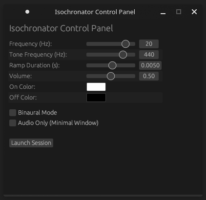

# Isochronator

A lightweight, cross-platform application for generating **isochronic tones** and **binaural beats** with synchronized visual stimuli, written in Rust 🦀.

<div align="center">

</div>

## Features

*   **Isochronic Tones:** Generates a pure sine wave tone that pulses at a specified frequency.
*   **Binaural Beats:** Generates two slightly different pure sine wave tones, one for each ear, creating the perception of a third "beat" frequency within the brain.
*   **Visual Stimulus:** The screen flashes in sync with the audio tone.
*   **Graphical User Interface:** A simple GUI for configuring the tone and visual stimulus parameters.
*   **Configurable:** Set the primary frequency, base tone, on/off colors, audio ramp time, and volume from the command line.
*   **Cross-Platform:** Built with `egui`, `pixels`, and `cpal`, it should run on Windows, macOS, and Linux.

> [!CAUTION]
> ## HEALTH AND SAFETY WARNING
>
> This software produces intense flashing lights that can trigger seizures in people with photosensitive epilepsy (PSE). You may have this condition without knowing it.
>
> An audio-only mode is available to avoid visual stimuli.
> 
> **You assume all health risks by using this software. The developer is not liable for any harm caused.**

## Build & Run

1.  **Clone the repository:**
    ```sh
    git clone https://github.com/your-username/isochronator.git
    cd isochronator
    ```

2.  **Build and run the application:**
    For the best performance, run in release mode.

    ```sh
    cargo run --release
    ```

### Usage
Run without arguments to launch the GUI for interactive control. For command-line usage, append options as shown below.
Use `--help` to see all options.

```
Usage: isochronator [-f <frequency>] [-r <ramp-duration>] [-a <amplitude>] [-t <tone-hz>] [-b] [--on-color <on-color>] [--off-color <off-color>] [--headless] [--headless-profile] [--minimal-window]

A simple isochronic/binaural tone and visual stimulus generator. Run without arguments for a GUI control panel.

Options:
  -f, --frequency   the primary frequency of the isochronic tone/binaural beat
                    in Hz.
  -r, --ramp-duration
                    the duration of the audio fade-in/out ramp in seconds. Low
                    values may produce clicks.
  -a, --amplitude   the audio volume (0.0 to 1.0).
  -t, --tone-hz     the frequency of the audible sine wave tone in Hz.
  -b, --binaural    enable binaural beat mode instead of isochronic tones
  --on-color        the 'on' color of the screen flash (RRGGBB hex).
  --off-color       the 'off' color of the screen flash (RRGGBB hex).
  --headless        run in true headless mode (audio only, no window).
  --headless-profile
                    run headless for a few seconds to generate PGO profile data
                    (no audio/window).
  --minimal-window  run an audio-only session with a minimal window (for GUI
                    use).
  --help, help      display usage information
```

**Isohcronic Tone Example:** Run a 10 Hz session with a 500 Hz base tone, a very soft/slow audio pulse and low volume.

```sh
cargo run --release -- -f 10 -t 500 --ramp-duration 0.05 --amplitude 0.1
```

**Binaural Beat Example:** Run a 6 Hz session with a 200 Hz base tone

```sh
cargo run --release -- -f 6 -t 200 --binaural
```

If running from a prebuilt binary, replace `cargo run --release --` with `./isochronator`

## A Note on Visual Frequency and Monitor Refresh Rates

A computer screen can only update its image at a fixed rate (e.g., 60, 120, or 144 times per second, or Hz). This poses a challenge when trying to display a visual pulse at a frequency (like 40 Hz) that isn't a simple fraction of the refresh rate. A naive implementation would lead to stuttering, unevenly timed flashes.

This program solves the technical challenge by using **interpolation**. For every single frame the monitor displays, the program calculates the precise *average brightness* that should have been visible during that frame's time window (e.g., 1/60th of a second). This ensures the visual signal is mathematically perfect and smooth.

However, this can lead to two perceptual effects:

#### 1. Aliasing and Beat Frequencies

When the visual frequency is high and gets close to a fraction of the monitor's refresh rate, you may perceive a new, much slower pulse. This is a phenomenon called **aliasing**, or the stroboscopic effect.

**Example:**
On a **144 Hz** monitor, a **50 Hz** target frequency can produce a slow, visible "beat" of about **6 Hz**. This is because the monitor's frames are "sampling" the 50 Hz brightness wave at a rate that is slightly out of sync.

The math: `3 × 50 Hz = 150 Hz`, which is very close to `144 Hz`. The perceived beat is the difference: `|150 Hz - 144 Hz| = 6 Hz`.

This means that your brain may be drawn to this slower beat frequency instead of the intended 50 Hz, which can alter the entrainment effect.

#### 2. Flicker Fusion Threshold

As the frequency increases (typically above 60-90 Hz for most people), your brain can no longer perceive individual flashes. The light fuses into what appears to be a steady, solid color. At this point, the visual stimulus is no longer isochronic, and any brainwave entrainment will come from the audio only.

### Recommendations

For the clearest and most effective visual stimulus with no confusing beat frequencies, choose a target frequency that is a clean divisor of your monitor's refresh rate and is below or equal to 40 Hz.

Divisors for common refresh rates:
*   **For a 60 Hz Monitor:** 30, 20, 15, 12, 10 Hz.
*   **For a 120 Hz Monitor:** 60, 40, 30, 24, 20, 15, 12, 10 Hz.
*   **For a 144 Hz Monitor:** 72, 48, 36, 24, 18, 12 Hz.